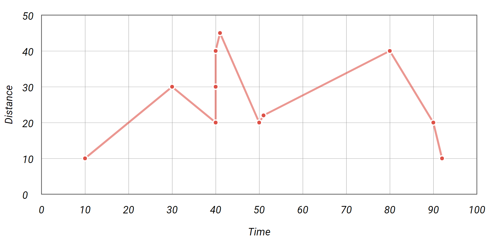
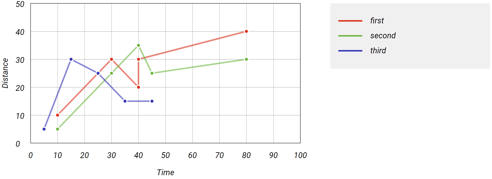
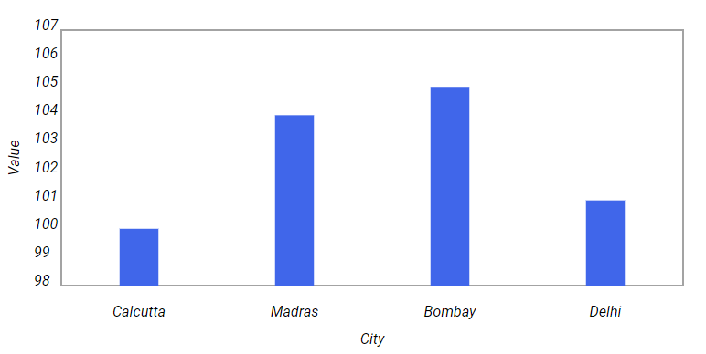
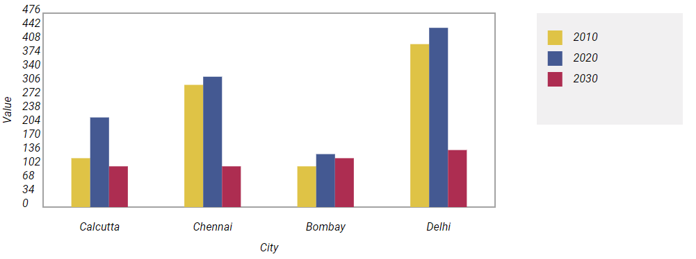
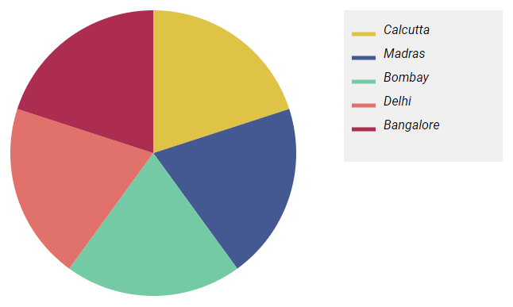
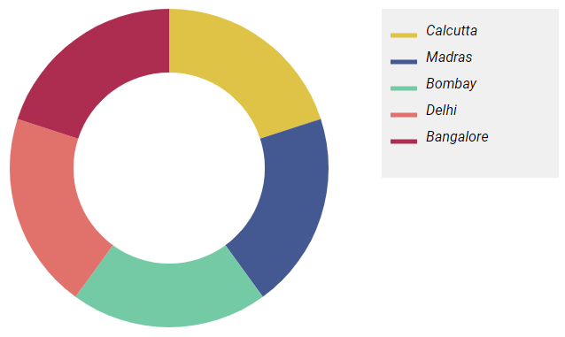
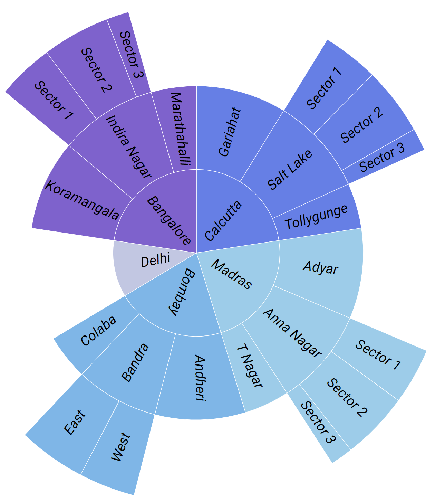
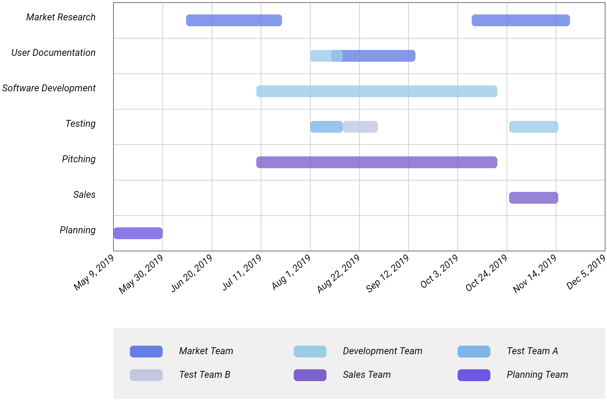

# NgxBeautifulCharts

This library was generated with [Angular CLI](https://github.com/angular/angular-cli) version 8.0.1.

Started out initially as an interesting way to pass time, NgxBeautifulCharts turned out to be something that could be useful to anyone who wants to create charts in Angular. I have tried to make the charts as customizable and aesthetically pleasing as possible. More charts coming soon! :)

## Install via NPM

> npm i ngx-beautiful-charts

## Types of charts offered
- Line Graph
- Multi Line Graph
- Bar Chart
- Clustered Bar Chart
- Pie Chart
- Donut Chart
- Sunburst Chart
- Gantt Chart

## How to use them

### Line Graph



#### TypeScript:
```
lineData = [
    {x: 10, y: 10, info: ''},
    {x: 80, y: 40, info: ''},
    {x: 30, y: 30, info: ''},
    {x: 40, y: 20, info: ''},
    {x: 40, y: 30, info: ''},
    {x: 40, y: 40, info: ''},
    {x: 50, y: 20, info: ''},
    {x: 90, y: 20, info: ''},
    {x: 41, y: 45, info: ''},
    {x: 51, y: 22, info: ''},
    {x: 92, y: 10, info: ''}
  ];
```

#### HTML:
```
<ngx-beautiful-charts [width]="800" [height]="400" 
[minX]="0" [maxX]="100" 
[minY]="0" [maxY]="50" 
[gridPrecisionX]="10" 
[gridPrecisionY]="10"
[displayXAxis]="true"
[displayYAxis]="true"
xAxisTitle="Time"
yAxisTitle="Distance"
[data]="lineData"
chartType="line-graph"
color="#ff4444"></ngx-beautiful-charts>
```

### Multi Line Graph



#### TypeScript:
```
multiLineData = [
    {name: 'first', color: '#ff1111', data: [
      {x: 10, y: 10, info: 'Point 1'},
      {x: 80, y: 40, info: 'Point 2'},
      {x: 30, y: 30, info: 'Point 3'},
      {x: 40, y: 20, info: 'Point 4'},
      {x: 40, y: 30, info: 'Point 5'}
    ]},
    {name: 'second', color: '#33bb33', data: [
      {x: 10, y: 5, info:  ''},
      {x: 80, y: 30, info: ''},
      {x: 30, y: 25, info: ''},
      {x: 40, y: 35, info: ''},
      {x: 45, y: 25, info: ''}
    ]},
    {name: 'third', color: '#3333bb', data: [
      {x: 5, y: 5, info: ''},
      {x: 15, y: 30, info: ''},
      {x: 25, y: 25, info: ''},
      {x: 35, y: 15, info: ''},
      {x: 45, y: 15, info: ''}
    ]}
  ];
```

#### HTML:
```
<ngx-beautiful-charts [width]="1100" [height]="400" 
[minX]="0" [maxX]="100" [minY]="0" [maxY]="50" 
[gridPrecisionX]="10" [gridPrecisionY]="10"
[displayXAxis]="true" [displayYAxis]="true"
xAxisTitle="Time" yAxisTitle="Distance"
[data]="multiLineData" chartType="multi-line-graph">
</ngx-beautiful-charts>
```

### Bar Chart



#### TypeScript:
```
barChartData = [
    {
      name: 'Calcutta',
      value: 1
    },
    {
      name: 'Madras',
      value: 3
    },
    {
      name: 'Bombay',
      value: 9
    },
    {
      name: 'Delhi',
      value: 8
    }
  ];
```

#### HTML:
```
<ngx-beautiful-charts [width]="800" [height]="400"
[displayXAxis]="true" colorScheme="cool"
[displayYAxis]="true"
xAxisTitle="City"
yAxisTitle="Value"
[data]="barChartData"
chartType="bar-chart" [showGridLines]="false"
color="#1166ee"></ngx-beautiful-charts>
```

### Clustered Bar Chart



#### TypeScript:
```
clusteredBarChartData = [
    {
      series: '2010',
      color: '#EAC435',
      data: [
        {
          name: 'Calcutta',
          value: 120
        },
        {
          name: 'Chennai',
          value: 300
        },
        {
          name: 'Bombay',
          value: 100
        },
        {
          name: 'Delhi',
          value: 400
        }
      ]
    },
    {
      series: '2020',
      color: '#345995',
      data: [
        {
          name: 'Calcutta',
          value: 220
        },
        {
          name: 'Chennai',
          value: 320
        },
        {
          name: 'Bombay',
          value: 130
        },
        {
          name: 'Delhi',
          value: 440
        }
      ]
    },
    {
      series: '2030',
      color: '#CA1551',
      data: [
        {
          name: 'Calcutta',
          value: 100
        },
        {
          name: 'Chennai',
          value: 100
        },
        {
          name: 'Bombay',
          value: 120
        },
        {
          name: 'Delhi',
          value: 140
        }
      ]
    }
  ];
```

#### HTML:
```
<ngx-beautiful-charts [width]="1100" [height]="400"
[displayXAxis]="true"
[displayYAxis]="true"
xAxisTitle="City"
yAxisTitle="Value"
[data]="clusteredBarChartData"
chartType="clustered-bar-chart"></ngx-beautiful-charts>
```

### Pie Chart



#### TypeScript:
```
pieChartData = [
    {
      name: 'Calcutta',
      color: '#EAC435',
      value: 50
    },
    {
      name: 'Madras',
      color: '#345995',
      value: 50
    },
    {
      name: 'Bombay',
      color: '#03CEA4',
      value: 50
    },
    {
      name: 'Delhi',
      color: '#FF6B6B',
      value: 50
    },
    {
      name: 'Bangalore',
      color: '#CA1551',
      value: 50
    }
  ];
```

#### HTML:
```
<ngx-beautiful-charts [width]="800"
[data]="pieChartData"
chartType="pie-chart"></ngx-beautiful-charts>
```

### Donut Chart



#### TypeScript:
```
donutChartData = [
    {
      name: 'Calcutta',
      color: '#EAC435',
      value: 50
    },
    {
      name: 'Madras',
      color: '#345995',
      value: 50
    },
    {
      name: 'Bombay',
      color: '#03CEA4',
      value: 50
    },
    {
      name: 'Delhi',
      color: '#FF6B6B',
      value: 50
    },
    {
      name: 'Bangalore',
      color: '#CA1551',
      value: 50
    }
  ];
```

#### HTML:
```
<ngx-beautiful-charts [width]="800"
[data]="donutChartData"
chartType="donut-chart"></ngx-beautiful-charts>
```

### Sunburst Chart



#### TypeScript:
```
sunburstChartData = [
    {
      name: 'Calcutta',
      children: [
        { name: 'Gariahat', value: 120 },
        { name: 'Salt Lake', children: [
          { name: 'Sector 1', value: 50 },
          { name: 'Sector 2', value: 60 },
          { name: 'Sector 3', value: 20 }
        ]},
        { name: 'Tollygunge', value: 60 }
      ]
    },
    {
      name: 'Madras',
      children: [
        { name: 'Adyar', value: 120 },
        { name: 'Anna Nagar', children: [
          { name: 'Sector 1', value: 50 },
          { name: 'Sector 2', value: 60 },
          { name: 'Sector 3', value: 20 }
        ]},
        { name: 'T Nagar', value: 60 }
      ]
    },
    {
      name: 'Bombay',
      children: [
        { name: 'Andheri', value: 120 },
        { name: 'Bandra', children: [
          { name: 'West', value: 50 },
          { name: 'East', value: 60 }
        ]},
        { name: 'Colaba', value: 60 }
      ]
    },
    {
      name: 'Delhi',
      value: 150
    },
    {
      name: 'Bangalore',
      children: [
        { name: 'Koramangala', value: 120 },
        { name: 'Indira Nagar', children: [
          { name: 'Sector 1', value: 50 },
          { name: 'Sector 2', value: 60 },
          { name: 'Sector 3', value: 20 }
        ]},
        { name: 'Marathahalli', value: 60 }
      ]
    }
  ];
```

#### HTML:
```
<ngx-beautiful-charts [width]="700"
[data]="sunburstChartData" colorScheme="cool"
chartType="sunburst-chart"></ngx-beautiful-charts>
```


### Gantt Chart



#### TypeScript:
```
ganttChartData = [
    {
      name: 'Market Team',
      timelines: {
        'Market Research': [
          {from: 'June 9, 2019', to: 'July 20, 2019', info: 'wtv'},
          {from: 'October 9, 2019', to: 'November 20, 2019', info: 'wtv'}
        ],
        'User Documentation': [
          {from: 'August 10, 2019', to: 'September 15, 2019', info: 'wtv'}
        ]
      }
    },
    {
      name: 'Development Team',
      timelines: {
        'Software Development': [
          {from: 'July 9, 2019', to: 'October 20, 2019', info: 'wtv'}
        ],
        'Testing': [
          {from: 'October 25, 2019', to: 'November 15, 2019', info: 'wtv'}
        ],
        'User Documentation': [
          {from: 'August 1, 2019', to: 'August 15, 2019', info: 'wtv'}
        ]
      }
    },
    {
      name: 'Test Team A',
      timelines: {
        'Testing': [
          {from: 'August 1, 2019', to: 'August 15, 2019', info: 'wtv'}
        ]
      }
    },
    {
      name: 'Test Team B',
      timelines: {
        'Testing': [
          {from: 'August 15, 2019', to: 'August 30, 2019', info: 'wtv'}
        ]
      }
    },
    {
      name: 'Sales Team',
      timelines: {
        'Pitching': [
          {from: 'July 9, 2019', to: 'October 20, 2019', info: 'wtv'}
        ],
        'Sales': [
          {from: 'October 25, 2019', to: 'November 15, 2019', info: 'wtv'}
        ]
      }
    },
    {
      name: 'Planning Team',
      timelines: {
        'Planning': [
          {from: 'May 9, 2019', to: 'May 30, 2019', info: 'wtv'}
        ]
      }
    }
  ];
```

#### HTML:
```
<ngx-beautiful-charts [width]="1100"
[data]="ganttChartData" colorScheme="cool"
chartType="gantt-chart"></ngx-beautiful-charts>
```
<!-- 
## Code scaffolding

Run `ng generate component component-name --project regular-charts` to generate a new component. You can also use `ng generate directive|pipe|service|class|guard|interface|enum|module --project regular-charts`.
> Note: Don't forget to add `--project regular-charts` or else it will be added to the default project in your `angular.json` file. 

## Build

Run `ng build regular-charts` to build the project. The build artifacts will be stored in the `dist/` directory.

## Publishing

After building your library with `ng build regular-charts`, go to the dist folder `cd dist/regular-charts` and run `npm publish`.

## Running unit tests

Run `ng test regular-charts` to execute the unit tests via [Karma](https://karma-runner.github.io).

## Further help

To get more help on the Angular CLI use `ng help` or go check out the [Angular CLI README](https://github.com/angular/angular-cli/blob/master/README.md). -->
